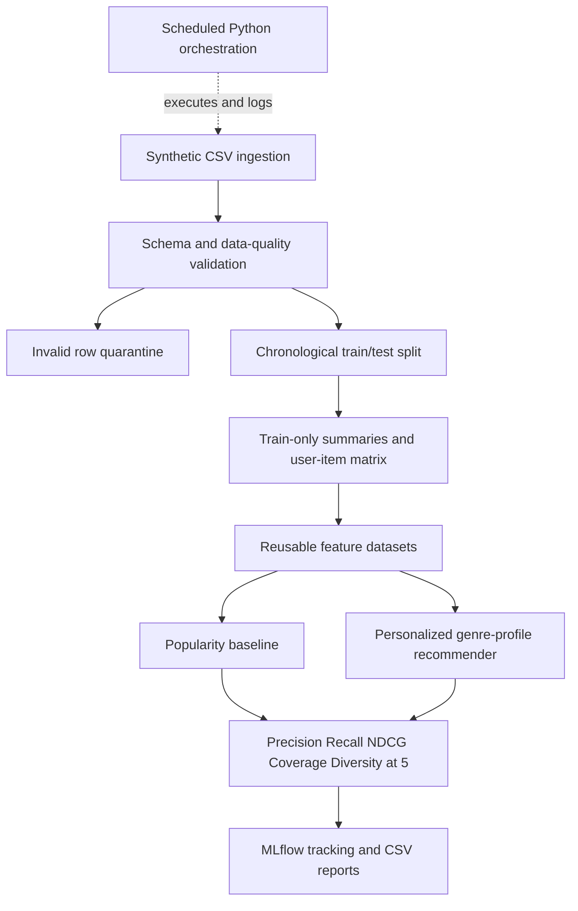

# Pipeline architecture

```mermaid
flowchart TD
 A[Synthetic CSV ingestion] --> B[Schema and data-quality validation]
 B --> C[Invalid row quarantine]
 B --> D[Chronological train/test split]
 D --> E[Train-only summaries and user-item matrix]
 E --> F[Reusable feature datasets]
 F --> G[Popularity baseline]
 F --> H[Personalized genre-profile recommender]
 G --> I[Precision Recall NDCG Coverage Diversity at 5]
 H --> I
 I --> J[MLflow tracking and CSV reports]
 W[Scheduled Python orchestration] -.executes and logs.-> A
```

Training features and item priors are derived exclusively from historical training interactions. The test period remains held out.
